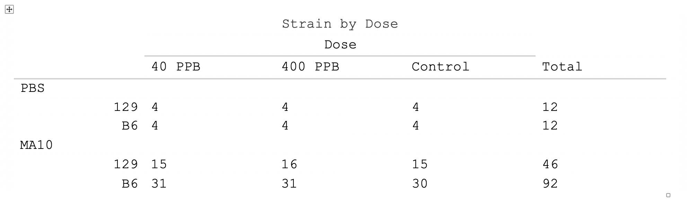

```{r, include = FALSE}
knitr::opts_chunk$set(
  message = FALSE,
  warning = FALSE,
  collapse = TRUE,
  comment = "#>"
)
```

```{r setup}
library(openTable)
```

## Overview

I have written some functions to facilitate the creation of publication quality tables. These functions grew mainly out of my industry consulting work, where reports can contain hundreds of tables, and often require multiple drafts. To this end, I wanted to create a tool that allowed tables to be created quickly, and minimized the time spent formatting. My purpose was is two-fold:

1. To faciliate compilation of tables from multiple sources.

Often in collaborative projects, labor has been divided such that subsets of a report's final set of tables are created by different parties. In my experience, each group spends time formatting their own tables. In the end, when they are compiled, someone has to harmonize the formatting, so all the time the individuals spent formatting is more or less wasted. Now, multiply that wasted time across multiple drafts. Wasted time to the $n^{th}$ power. More generally, formatting tables in Miscrosoft Word is a total waste of time because that software is essentially malware. We should strive to minimize the time we spend in Word, Excel, etc.

{#id .class width=80% height=80%}

2. To create an interface to the R package `gt()` 

There are several good R packges for table creation, each of which has its own grammar, and none of which is difficult to learn. I have chosen to use the `gt()` package as the table-creating engine. I did not pick this package for any special reason, it's just what I was familiar with. If there is a better package, I am happy to switch to it - this will not be difficult. Let's consider a very simple table that we want to look like this:

``` {r, eval = FALSE}
gt.object <- final.dat %>%
  gt(rowname_col = "row_labels") %>%
  tab_header(title = "Strain by Dose",
             subtitle = "") %>%
  tab_spanner(label = "Dose ",
              columns = c(`40 PPOB`, `400 PPB`, `Control`)) %>%
  tab_row_group(label = "MA10 ", rows = c(1, 2)) %>%
  tab_row_group(label = "PBS ", rows = c(3, 4))
```

Note that the text "Dose" is what `gt()` refers to as a `tab_spanner()`, and that the "PBS" and "MA10" labels are what gt() refers to as a tab_row_group(). You can imagine much more complicated tables that include a subset of columns that require tab_spanners and a subset of rows that require tab_row_groups.

Rather than require the user to write such code for every table, my code automatically creates the R code to make the table in a dynamic way. Specifically, the user's interface to `gt()` is simply in the column and row names of an R data frame. The user simply creates a dataframe that houses the actual data (in the above example, a 4-by-4 dataframe). The user then adds column names and rownames. Any columns or rows that should be spanned by a higher-level label simply need that label pre-appended to the row/column names along with a pipe as a delimiter. 

## Example

For example, I will create the above table. Start by putting the data into a data frame:

```{r chunk1}
samples.dat <-
  as.data.frame(matrix(
    c(15, 31, 4, 4, 16, 31, 4, 4, 15, 30, 4, 4, 46, 92, 12, 12),
    nrow = 4,
    ncol = 4
  ))
print(samples.dat)
```

Add the row and column names:

```{r chunk2}
rownames(samples.dat) <-
  paste0(c("MA10|", "MA10|", "PBS|", "PBS|"), c("129", "B6", "129", "B6"))
colnames(samples.dat) <-
  c("Dose|40 PPB", "Dose|400 PPB", "Dose|Control", "Total")

print(samples.dat)
```
